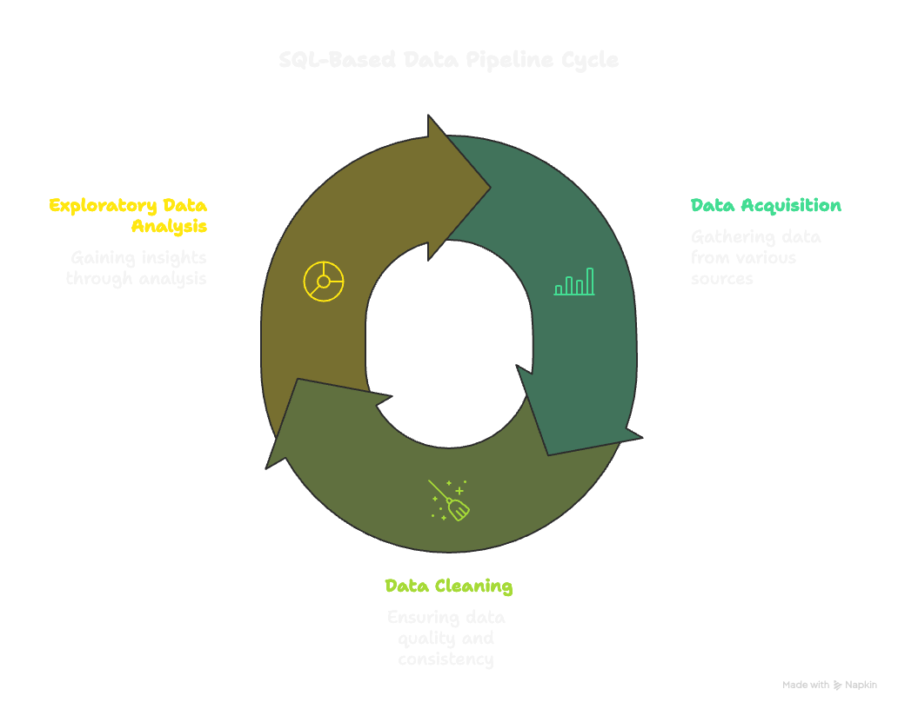

# WorldLife-Expectancy-EDA

## Key Takeaways

- Countries with higher GDP consistently show longer average lifespans, with a gap of nearly **10 years** compared to lower-GDP nations.  
- Developed nations enjoy an average life expectancy of **79.2 years**, while developing nations average **66.83 years**, a difference of more than **12 years**.  
- Economic strength and national development strongly influence public health through better healthcare systems, nutrition, education, and infrastructure.  

## Insights

- **GDP and Life Expectancy**  
  - The dataset suggests a positive correlation between life expectancy and GDP. Countries with stronger economic output tend to report longer lifespans.  
  - In the higher-GDP group (GDP ≥ 1,500), there are **1,326 records** with an **average life expectancy of 74.2 years**.  
  - In the lower-GDP group (GDP ≤ 1,500), there are **1,612 records** with an **average life expectancy of 64.7 years**.  
  - This nearly **10-year gap** indicates that higher economic performance supports longer, healthier lives. Factors include stronger healthcare systems, wider medical access, better nutrition, sanitation, and education. Conversely, lower-GDP populations often face weaker infrastructure and limited health resources, leading to shorter lifespans.  

- **Developed vs. Developing Countries**  
  - Among **32 developed nations**, the **average life expectancy is 79.2 years**.  
  - Among **161 developing countries**, the **average life expectancy is 66.83 years**.  
  - The gap of more than **12 years** highlights the influence of national development status. Developed nations benefit from advanced healthcare, higher living standards, and greater access to essential services, while developing nations continue to face systemic challenges that reduce life expectancy.  
